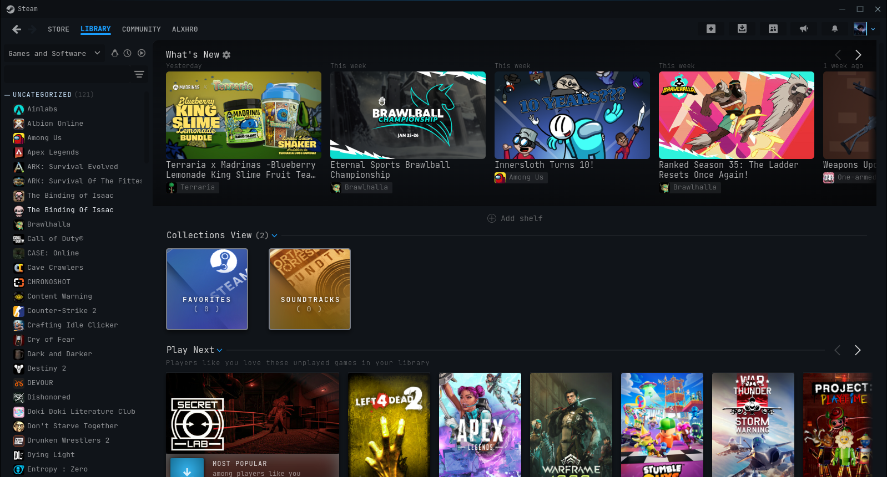

   
# Infinity
A dark theme which gives you, a break from Steam's eye tiring theme. 

If you enjoy this theme, please consider starring the project ⭐

## Info
This theme is based on [Simply-dark](https://github.com/shdwmtr/simply-dark) by [shdwmtr](https://github.com/shdwmtr)

I'm planning on "extending" the theme, but for now it will stay as a almost 100% exact copy of Simply-dark

## Installation
1. Download [Millennium](https://steambrew.app/). Follow the instructions provided to install the patcher.
1. Open Steam and navigate to `Steam -> Settings -> Interface -> Open Millennium`
1. With the Millennium interface open, drag the install button overtop of the interface.
1. From there, you will see a install prompt. Now simply drop the theme
1. Select the theme from the interface after it installs.

## Issues
If any bugs present themselves that inherently affect your Steam experience, you can fix them, create a pull request and become a contributor/developer. 
You can also create an issue and might be fixed for you. 

## Customization
Infinity allows you to customize some parts of the Steam client component. For now, there are 7 customization options available.

1. **Color Settings**: Controls the color used in the theme.
1. **Compacted Header**: Allows you to put the _"Store, Library, and Community"_ bar into one single row above with the Steam logo.
1. **Wallet visibility**: Allows you to hide the wallet amount from user menu.
1. **URL visibility**: Allows you to hide the URL bar when browsing inside the Steam client.
1. **"What's New" visibility**: Allows you to hide recent updates and news from the games you own inside the library page.
1. **Friends Outline**: Allows you show the friends status in friends tab via outline in the avatar.
1. **Steam News Visibility**: Allows you hide the "megaphone" (steam news) icon on top right.

## Contributing
To edit the theme, you have to launch Steam with -dev mode, then you edit the CSS classes with the inspector on the Steam Window

## Original Thanks
Special Thanks to:
- [shdwmtr](https://github.com/shdwmtr), [clawdius](https://github.com/clawdius),  (creator, developer)
- [MapleAtMorning](https://github.com/MapleAtMorning) (maintaining).
- [Preshyon](https://github.com/madmaxgrey) (bug fixing).
   
Contributing is encouraged. Anyone can create a pull request if it's deemed useful.
